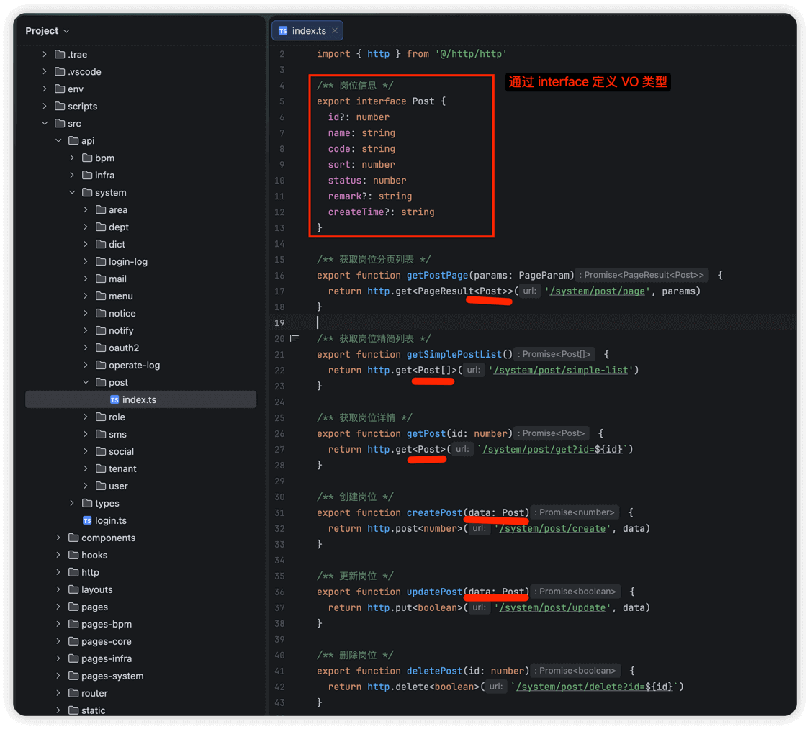

# 开发规范

Source: https://doc.iocoder.cn/admin-uniapp/dev-spec/

本项目基于 [unibest](https://unibest.tech/)  作为模版，采用 uniapp + Vue 3 + TypeScript + Vite 技术栈，使用 [Wot UI](https://wot-ui.cn/)  库。

## 0. 实战案例

本小节，提供大家开发移动端功能时，最常用的分页列表页面、树形页面的实战案例。

### 0.1 分页列表

可参考 [系统管理 -> 岗位管理] 功能：

- API 接口：[`/src/api/system/post/index.ts`](https://github.com/yudaocode/yudao-ui-admin-uniapp/blob/master/src/api/system/post/index.ts)
- 列表页面：[`/src/pages-system/post/index.vue`](https://github.com/yudaocode/yudao-ui-admin-uniapp/blob/master/src/pages-system/post/index.vue)
- 详情页面：[`/src/pages-system/post/detail/index.vue`](https://github.com/yudaocode/yudao-ui-admin-uniapp/blob/master/src/pages-system/post/detail/index.vue)
- 表单页面：[`/src/pages-system/post/form/index.vue`](https://github.com/yudaocode/yudao-ui-admin-uniapp/blob/master/src/pages-system/post/form/index.vue)

### 0.2 树形列表

可参考 [系统管理 -> 部门管理] 功能：

- API 接口：[`/src/api/system/dept/index.ts`](https://github.com/yudaocode/yudao-ui-admin-uniapp/blob/master/src/api/system/dept/index.ts)
- 列表页面：[`/src/pages-system/dept/index.vue`](https://github.com/yudaocode/yudao-ui-admin-uniapp/blob/master/src/pages-system/dept/index.vue)
- 详情页面：[`/src/pages-system/dept/detail/index.vue`](https://github.com/yudaocode/yudao-ui-admin-uniapp/blob/master/src/pages-system/dept/detail/index.vue)
- 表单页面：[`/src/pages-system/dept/form/index.vue`](https://github.com/yudaocode/yudao-ui-admin-uniapp/blob/master/src/pages-system/dept/form/index.vue)

也可参考 [系统管理 -> 菜单管理] 功能，对应 [`/src/pages-system/menu/`](https://github.com/yudaocode/yudao-ui-admin-uniapp/blob/master/src/pages-system/menu/)  目录。

## 1. pages 页面（view）

### 1.1 页面组织

页面按照功能模块进行分包，主要分为：

| 目录 | 说明 |
| --- | --- |
| `pages/` | 主包页面，包含 Tabbar 页面（首页、工作流、通讯录、消息、我的） |
| `pages-core/` | 核心分包，包含登录、注册、错误页等 |
| `pages-system/` | 系统管理分包 |
| `pages-infra/` | 基础设施分包 |
| `pages-bpm/` | 工作流分包 |

为什么要分包？

小程序有主包大小限制（2 MB），分包可以有效减小主包体积，提升首屏加载速度。

另外，在微信小程序的开发模式下，包可能会超过 1.5 MB 大小，这是正常现象，编译打包后就会恢复正常。

### 1.2 页面结构

在 [`src/pages-system`](https://github.com/yudaocode/yudao-ui-admin-uniapp/tree/master/src/pages-system)  目录下，每个模块对应一个目录，它的所有功能的 `.vue` 都放在该目录里。

一般来说，一个路由对应一个 `index.vue` 文件，详情页面放在 `detail` 子目录下，表单页面放在 `form` 子目录下，页面私有组件放在 `components` 子目录下。

每个功能模块的页面结构如下：

```
pages-system/post/           # 岗位管理
├── components/              # 页面私有组件
│   └── search-form.vue      # 搜索表单组件
├── detail/                  # 详情页面
│   └── index.vue
├── form/                    # 表单页面（新增/编辑）
│   ├── components/          # 表单私有组件
│   └── index.vue
└── index.vue                # 列表页面
```

ps：其它 `src/pages-xxx` 目录下的页面结构类似。

### 1.3 页面配置

使用 `definePage` 宏配置页面信息，支持约定式路由：

```
<script lang="ts" setup>
  definePage({
    style: {
      navigationStyle: 'custom', // 自定义导航栏
      navigationBarTitleText: '', // 页面标题
    },
    excludeLoginPath: false, // 是否需要登录，默认为 false（一般情况下，不用添加）
  })
</script>
```

关于 definePage 更多的介绍，可见 [《unibest 官方文档 —— uni 插件》](https://unibest.tech/base/3-plugin)  文档。

## 2. api 请求

在 [`src/api`](https://github.com/yudaocode/yudao-ui-admin-uniapp/tree/master/src/api)  目录下，每个模块对应一个目录，包含该模块的所有 API 文件。



每个 API 文件通常包含：

- API 方法：调用 `http` 发起对后端 RESTful API 的请求
- `interface` 类型：定义 API 的请求参数和返回结果的类型，对应后端的 VO 类型

### 2.1 请求封装

项目使用 [`src/http/http.ts`](https://github.com/yudaocode/yudao-ui-admin-uniapp/blob/master/src/http/http.ts)  基于 `uni.request` 进行请求封装，提供统一的请求方法。

官方文档

详细的请求配置和使用方式，请参考：[《unibest 官方文档 —— 请求篇》](https://doc.vben.pro/guide/essentials/server.html) 。

注意：项目使用的是 `简单版本http` 噢，类似 `alova 的 http` 和 `vue-query` 已经删除（控制包大小）。

请求封装中包含了以下核心功能：

- 租户支持：自动在请求头中添加 `tenant-id` 租户编号
- 访问令牌：自动在请求头中添加 `Authorization` Bearer Token
- 刷新令牌：当访问令牌过期时，自动使用 `refreshToken` 刷新令牌（双 Token 模式）
- API 加密：支持请求数据加密和响应数据解密
- 错误处理：统一的错误消息提示和 401 未登录处理

## 3. component 组件

### 3.1 全局组件

在 [`src/components`](https://github.com/yudaocode/yudao-ui-admin-uniapp/tree/master/src/components)  目录下，实现全局公共组件：

```
components/
├── dict-tag/                 # 字典标签组件
│   └── index.vue
└── system-select/            # 系统选择组件
    ├── dept-select.vue       # 部门选择
    ├── user-select.vue       # 用户选择
```

---

更多说明，可见 [系统组件](../component/index.md) 文档。

### 3.2 页面组件

每个页面的私有组件，放在页面目录下的 `components` 目录：

```
pages/index/
├── components/
│   ├── banner.vue            # 轮播图组件
│   ├── menu-section.vue      # 菜单区域组件
│   └── user-header.vue       # 用户头部组件
└── index.vue
```

## 4. style 样式

项目使用 [UnoCSS](https://unocss.dev/)  作为原子化 CSS 解决方案，可参考如下文档：

- [《unibest 官方文档 —— UnoCSS》](https://unibest.tech/base/4-style)

## 5. store 状态管理

项目使用 [Pinia](https://pinia.vuejs.org/)  进行状态管理，配合 `pinia-plugin-persistedstate` 插件实现数据持久化。

Store 文件位于 [`src/store`](https://github.com/yudaocode/yudao-ui-admin-uniapp/tree/master/src/store)  目录下：

```
store/
├── index.ts                  # Store 入口，统一导出
├── user.ts                   # 用户信息（用户、角色、权限）
├── token.ts                  # Token 管理（登录、登出、刷新令牌）
├── dict.ts                   # 字典数据缓存
└── theme.ts                  # 主题配置
```

官方文档

详细的 Store 使用方式，请参考：[《unibest 官方文档 —— 状态管理篇》](https://unibest.tech/base/9-state)  文档。

## 6. 常见问题

- [《unibest 官方文档 —— 常见问题》](https://unibest.tech/base/14-faq)
- [《unibest 官方文档 —— 常见问题 2》](https://unibest.tech/base/15-faq)
- [《Wot UI 官方文档 —— 常见问题》](https://wot-ui.cn/guide/common-problems.html)
