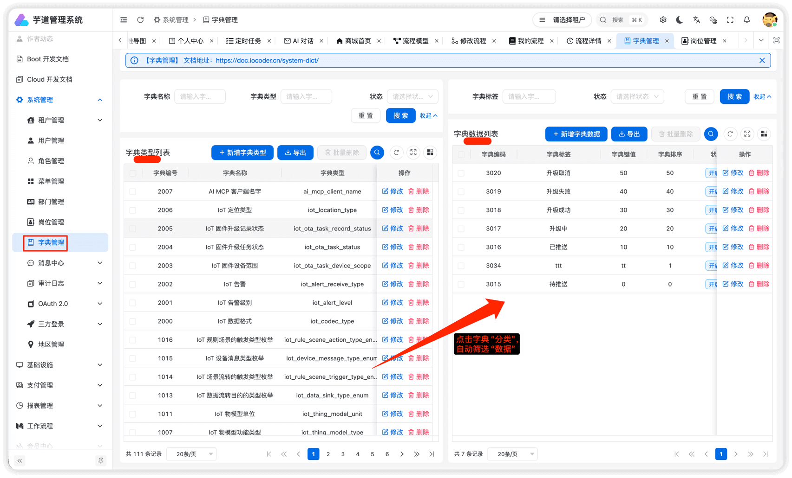

# 字典数据

Source: https://doc.iocoder.cn/admin-uniapp/dict/

本小节，讲解前端如何使用 [系统管理 -> 字典管理] 菜单的字典数据，例如说字典数据的下拉框、单选按钮、高亮展示等等。

> 

## 1. 全局缓存

用户登录成功后，前端会从后端获取到全量的字典数据，缓存在 Pinia Store 中，可见 [src/store/dict.ts](https://github.com/yudaocode/yudao-ui-admin-uniapp/blob/master/src/store/dict.ts)  源码。

这样，前端在使用到字典数据时，无需重复请求后端，提升用户体验。

不过，缓存暂时未提供刷新，所以在字典数据发生变化时，需要用户刷新浏览器，进行重新加载。

## 2. DICT\_TYPE

在 [`dict.ts`](https://github.com/yudaocode/yudao-ui-admin-uniapp/blob/master/src/utils/dict.ts)  文件中，使用 `DICT_TYPE` 枚举了字典的 KEY。

```
export enum DICT_TYPE {
  // ========== 系统模块 ==========
  SYSTEM_USER_SEX = 'system_user_sex',
  COMMON_STATUS = 'common_status',
  // ... 其他字典类型
}
```

后续如果有新的字典 KEY，需要你自己进行添加。

## 3. DictTag 字典标签

[src/components/dict-tag/dict-tag.vue](https://github.com/yudaocode/yudao-ui-admin-uniapp/blob/master/src/components/dict-tag/dict-tag.vue) 
提供 `<DictTag />` 组件，翻译字段对应的字典展示文本，并根据 `colorType`、`cssClass` 进行高亮。

### 3.1 基础用法

```
<template>
  <!--
    type: 字典类型
    value: 字典值
  -->
  <DictTag :type="DICT_TYPE.COMMON_STATUS" :value="item.status" />
</template>

<script setup lang="ts">
import { DICT_TYPE } from '@/utils/dict'
</script>
```

### 3.2 组件属性

| 属性 | 说明 | 类型 | 默认值 |
| --- | --- | --- | --- |
| type | 字典类型 | string | - |
| value | 字典值 | any | - |
| plain | 是否镂空 | boolean | true |

## 4. 字典工具类

在 [`useDict.ts`](https://github.com/yudaocode/yudao-ui-admin-uniapp/blob/master/src/hooks/useDict.ts)  文件中，提供了字典工具类。

### 4.1 getDictLabel

获取字典标签文本。

```
import { getDictLabel } from '@/hooks/useDict'
import { DICT_TYPE } from '@/utils/dict'

// 获取状态标签，如 "开启"、"关闭"
const label = getDictLabel(DICT_TYPE.COMMON_STATUS, 0)
```

### 4.2 getDictObj

获取字典对象，包含 label、value、colorType、cssClass。

```
import { getDictObj } from '@/hooks/useDict'
import { DICT_TYPE } from '@/utils/dict'

const dictObj = getDictObj(DICT_TYPE.COMMON_STATUS, 0)
// { label: '开启', value: '0', colorType: 'success', cssClass: '' }
```

### 4.3 getDictOptions

① 获取字典数组，用于 picker、radio 等组件。

```
import { getDictOptions } from '@/hooks/useDict'
import { DICT_TYPE } from '@/utils/dict'

// 获取字典选项，默认 string 类型
const options = getDictOptions(DICT_TYPE.COMMON_STATUS)
// [{ label: '开启', value: '0', colorType: 'success' }, { label: '关闭', value: '1', colorType: 'danger' }]

// 获取 number 类型的字典选项
const numberOptions = getDictOptions(DICT_TYPE.COMMON_STATUS, 'number')
// [{ label: '开启', value: 0, colorType: 'success' }, { label: '关闭', value: 1, colorType: 'danger' }]
```

② 也可以使用快捷方法，获取不同类型的字典选项。

```
import { getIntDictOptions, getStrDictOptions, getBoolDictOptions } from '@/hooks/useDict'

// 获取 number 类型的字典选项
const intOptions = getIntDictOptions(DICT_TYPE.COMMON_STATUS)

// 获取 string 类型的字典选项
const strOptions = getStrDictOptions(DICT_TYPE.COMMON_STATUS)

// 获取 boolean 类型的字典选项
const boolOptions = getBoolDictOptions(DICT_TYPE.SYSTEM_YES_NO)
```

## 5. 实战案例

### 5.1 列表展示

在列表中使用 `<DictTag />` 展示字典标签：

```
<template>
  <view v-for="item in list" :key="item.id" class="list-item">
    <text>{{ item.name }}</text>
    <DictTag :type="DICT_TYPE.COMMON_STATUS" :value="item.status" />
  </view>
</template>

<script setup lang="ts">
import { DICT_TYPE } from '@/utils/dict'
</script>
```

### 5.2 表单项

① 使用 `getDictOptions` 配合 `wd-picker` 实现字典选择：

```
<template>
  <wd-picker
    v-model="formData.status"
    label="状态"
    :columns="statusOptions"
    label-key="label"
    value-key="value"
  />
</template>

<script setup lang="ts">
import { ref, computed } from 'vue'
import { getDictOptions } from '@/hooks/useDict'
import { DICT_TYPE } from '@/utils/dict'

const formData = ref({ status: '' })
const statusOptions = computed(() => getDictOptions(DICT_TYPE.COMMON_STATUS))
</script>
```

② 使用 `getDictOptions` 配合 `wd-radio-group` 实现字典单选：

```
<template>
  <wd-radio-group v-model="formData.sex" shape="button">
    <wd-radio
      v-for="dict in sexOptions"
      :key="dict.value"
      :value="dict.value"
    >
      {{ dict.label }}
    </wd-radio>
  </wd-radio-group>
</template>

<script setup lang="ts">
import { ref, computed } from 'vue'
import { getIntDictOptions } from '@/hooks/useDict'
import { DICT_TYPE } from '@/utils/dict'

const formData = ref({ sex: 0 })
const sexOptions = computed(() => getIntDictOptions(DICT_TYPE.SYSTEM_USER_SEX))
</script>
```
