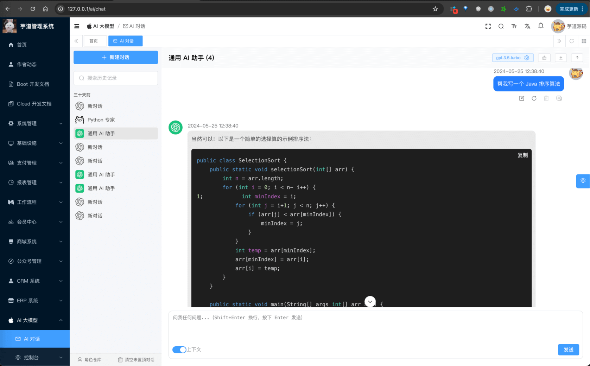
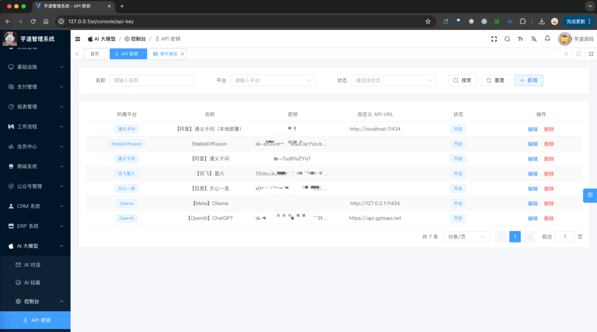
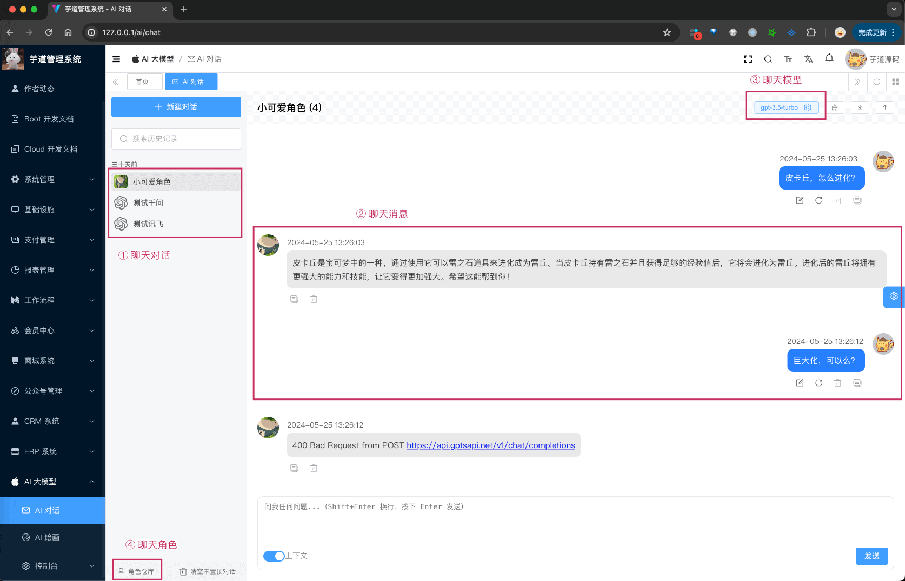
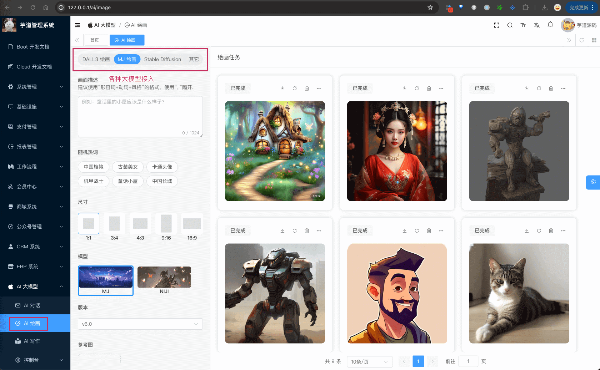
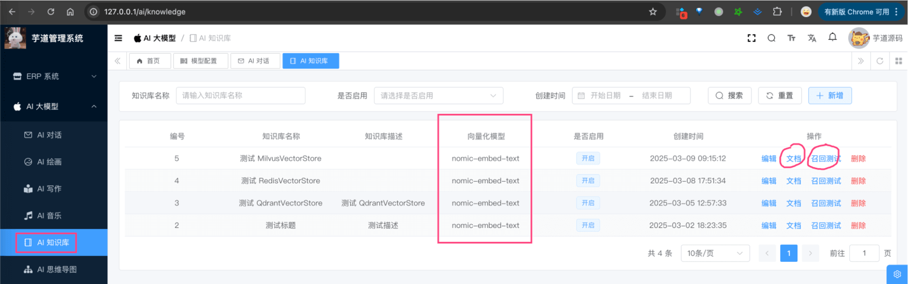
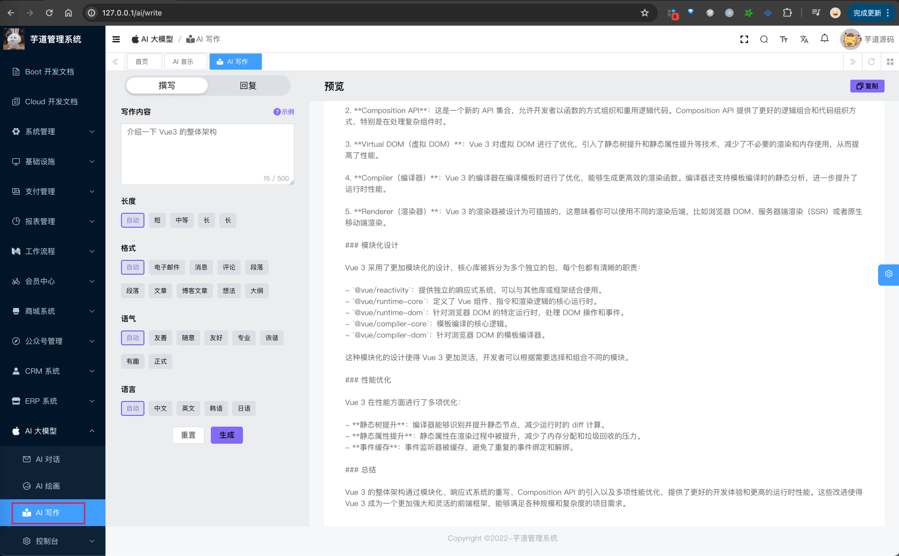
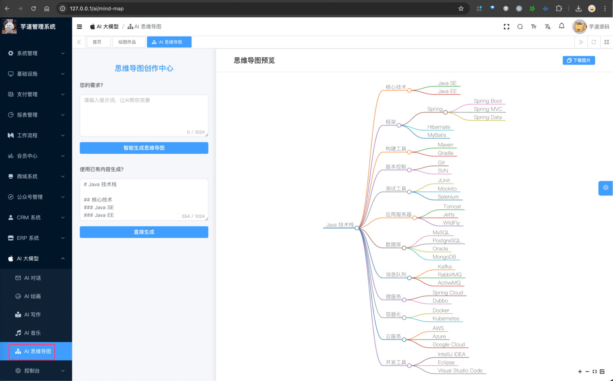

# AI 大模型演示

Source: https://doc.iocoder.cn/ai-preview/

## 1. 演示地址

### 1.1 管理后台

- 演示地址：<http://dashboard-vue3.yudao.iocoder.cn/>
- 菜单：“AI 大模型”下的「AI 聊天」「AI 绘画」「AI 知识库」「AI 工具」「AI 写作」「AI 脑图」「AI 音乐」「控制台」等等
- 仓库：<https://github.com/yudaocode/yudao-ui-admin-vue3> 的 `ai` 目录，基于 Vue3 + Element Plus 实现

### 1.2 AI 后端

支持 Spring Boot 单体、Spring Cloud 微服务架构

- 单体仓库： <https://github.com/YunaiV/ruoyi-vue-pro> 的 `yudao-module-ai` 模块
- 微服务仓库： <https://github.com/YunaiV/yudao-cloud> 的 `yudao-module-ai` 服务

## 2. AI 启动

参见 [《AI 手册 —— 功能开启》](../ai/build/index.md) 文档，一般 3 分钟就可以启动完成。

已经内置多个 AI 大模型（相关密钥已配置）：

- 国内：【阿里】通义千问、【深度求索】DeepSeek、【字节】豆包、【腾讯】混元、【百度】文心一言、【SiliconFlow】硅基流动、【讯飞】星火、【智谱】GLM、【月之月面】Moonshot、【MiniMax】MiniMax
- 国外：【OpenAI】GPT、【Anthropic】Claude、【Meta】Llama、【Google】Gemini、【Stability】Stable Diffusion

## 3. AI 交流群

专属交流社区，欢迎扫码加入。

## 4. 功能描述

主要分为 8 个核心模块：对话、绘画、知识库、工具、工作流、写作、脑图、音乐。

目前正在增加新的 4 个模块：语音、视频、翻译、PPT。

### 4.1 模型接入

| 模型（可点击链接，查看申请/部署文档） | 国内/国外 | 是否开源（私有化部署） |
| --- | --- | --- |
| [《【阿里】通义千问》](../ai/tongyi/index.md) | 国内 | √ |
| [《【深度求索】DeepSeek》](../ai/deep-seek/index.md) | 国内 | √ |
| [《【字节】豆包》](../ai/doubao/index.md) | 国内 | √ |
| [《【腾讯】混元》](../ai/hunyuan/index.md) | 国内 | √ |
| [《【百度】文心一言》](../ai/yiyan/index.md) | 国内 |  |
| [《【SiliconFlow】硅基流动》](../ai/siliconflow/index.md) | 国内 |  |
| [《【讯飞】星火认知》](../ai/xinghuo/index.md) | 国内 |  |
| [《【智谱】GLM》](../ai/glm/index.md) | 国内 | √ |
| [《【讯飞】星火认知》](../ai/xinghuo/index.md) | 国内 |  |
| [《【月之月面】Moonshot》](../ai/moonshot/index.md) | 国内 |  |
| [《【MiniMax】MiniMax》](../ai/minimax/index.md) | 国内 | √ |
| [《【百创智能】BaiChuan》](../ai/baichuan/index.md) | 国内 | √ |
|  |  |  |
| [《【OpenAI】ChatGPT》](../ai/openai/index.md) | 国外 |  |
| [《【OpenAI】Claude》](../ai/openai/index.md) | 国外 |  |
| [《【Anthropic】LLAMA》](../ai/claude/index.md) | 国外 | √ |
| [《【微软 OpenAI】ChatGPT》](../ai/azure-openai/index.md) | 国外 |  |
| [《【谷歌】Gemini》](../ai/yiyan/index.md) | 国外 | √(Gemma) |
| [《【Stability】Stable Diffusion》](../ai/stable-diffusion/index.md) | 国外 | √ |
| [《【Midjourney】Midjourney》](../ai/midjourney/index.md) | 国外 | √ |
| [《【Suno AI】Suno》](../ai/midjourney/index.md) | 国外 |  |

模型推理增强：

- [《推理模式（thinking）》](../ai/thinking/index.md)
- [《联网搜索》](../ai/web-search/index.md)

### 4.2 AI 对话聊天

详细说明，可见 [《AI 对话聊天》](../ai/chat/index.md) 文档

### 4.3 AI 绘画创作

详细说明，可见 [《AI 绘画创作》](../ai/image/index.md) 文档

### 4.4 AI 知识库

详细说明，可见 [《AI 知识库》](../ai/knowledge/index.md) 文档

### 4.5 AI 工作流

- [《AI 工作流》](../ai/workflow/index.md)
- [《接入 Dify 工作流》](../ai/dify/index.md)
- [《接入 FastGPT 工作流》](../ai/fastgpt/index.md)
- [《接入 Coze 工作流》](../ai/coze/index.md)

## 4.6 AI 工具调用

- [《AI 工具调用（function calling）》](../ai/tool/index.md)
- [《MCP Client 客户端》](../ai/mcp-client/index.md)
- [《MCP Server 服务端》](../ai/mcp-server/index.md)

### 4.7 AI 音乐创作

详细可见，可见 [《AI 音乐创作》](../ai/music/index.md) 文档

### 4.8 AI 写作助手

详细可见，可见 [《AI 写作助手》](../ai/write/index.md) 文档

### 4.9 AI 思维导图

详细可见，可见 [《AI 思维导图》](../ai/mindmap/index.md) 文档

