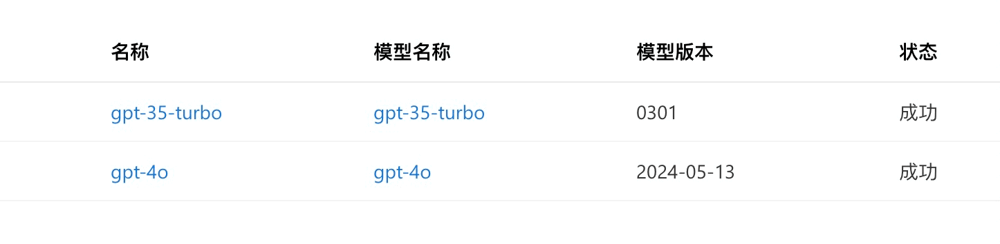
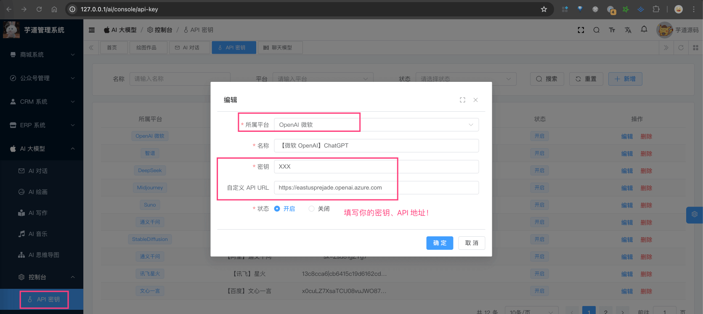

# 【模型接入】微软 OpenAI

Source: https://doc.iocoder.cn/ai/azure-openai/

项目基于 Spring AI 提供的 [`spring-ai-azure-openai`](https://github.com/spring-projects/spring-ai/tree/main/models/spring-ai-azure-openai) ，实现微软 Azure 上部署的 OpenAI 的接入：

| 功能 | 模型 | Spring AI 客户端 |
| --- | --- | --- |
| AI 对话 | gpt3.5、gpt4.0 等 | [Azure OpenAI Chat](https://docs.spring.io/spring-ai/reference/api/chat/azure-openai-chat.html) |
| AI 绘画 | [DALL](https://en.wikipedia.org/wiki/DALL-E) | [Azure OpenAI Image Generation](https://docs.spring.io/spring-ai/reference/api/image/azure-openai-image.html) |

## 1. 申请密钥

### 1.1 Azure API 申请

可以在 [微软 Azure AI](https://azure.microsoft.com/en-us/products/ai-services/openai-service)  进行申请申请。

我暂时没申请过，是由 [社区小伙伴](https://github.com/YunaiV/ruoyi-vue-pro/issues/614)  提供密钥进行接入的，应该不复杂。

申请完成后，应该会有类似的模型列表。如下图所示：



---

购买完成后，可以在我们系统的 [AI 大模型 -> 控制台 -> API 密钥] 菜单，进行密钥的配置。需要填写“密钥” + “自定义 API URL”。如下图所示：



## 2. 模型配置

友情提示：

目前 `ai_model` 表中，已经预置了一些模型，可以直接使用！！！

### 2.1 AI 对话

使用 [《AI 对话》](../chat/index.md) 时，需要在 [AI 大模型 -> 控制台 -> 模型配置] 菜单，配置对应的聊天模型。

模型有：`gpt-3.5-turbo`、`gpt-4-turbo` 等等。

注意，每个模型标识的 `max_tokens`（回复数 Token 数）是不同的。例如说：`gpt-3.5-turbo` 是 4096，`gpt-4-turbo` 是 8192。不确定的话，就填写 4096 先~跑通之后，再网上查查。

### 2.2 AI 绘画

TODO 暂未接入

## 3. 如何使用？

① 如果你的项目里需要直接通过 `@Resource` 注入 AzureOpenAIChatModel 等对象，需要把 `application.yaml` 配置文件里的 `spring.ai.openai` 配置项，替换成你的！

```
spring:
  ai:
    azure: # OpenAI 微软
      openai:
        endpoint: https://eastusprejade.openai.azure.com
        api-key: xxx
```

② 如果你希望使用 [AI 大模型 -> 控制台 -> API 密钥] 菜单的密钥配置，则可以通过 AiModelService 的 `#getChatModel(...)`，获取对应的模型对象。

---

① 和 ② 这两者的后续使用，就是标准的 Spring AI 客户端的使用，调用对应的方法即可。

另外，AzureOpenAIChatModelTests 里有对应的测试用例，可以参考。
