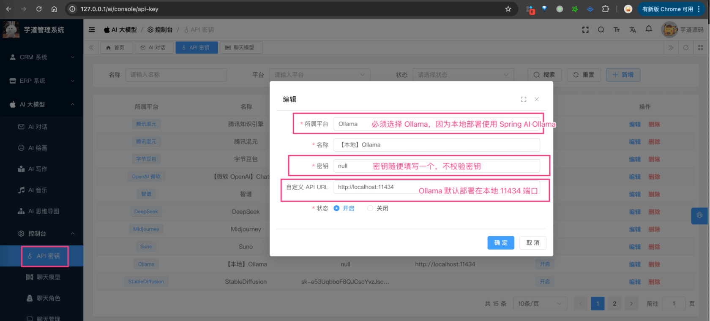

# 【模型接入】LLAMA

Source: https://doc.iocoder.cn/ai/llama/

项目基于 Spring AI 提供的 [`spring-ai-ollama`](https://github.com/spring-projects/spring-ai/tree/main/models/spring-ai-ollama) ，实现 Llama 的接入：

| 功能 | 模型 | Spring AI 客户端 |
| --- | --- | --- |
| AI 对话 | llama3、llama2 | [Ollama Chat](https://docs.spring.io/spring-ai/reference/api/chat/ollama-chat.html) |
| AI 绘画 | [llama3 支持生成图片](https://new.qq.com/rain/a/20240420A005CK00) | 暂未支持 |

## 1. 申请密钥

Llama 是 Meta 开源的模型，所以可以私有化部署。

### 1.1 私有化部署

① 访问 [Ollama 官网](https://ollama.ai/download) ，下载对应系统 Ollama 客户端，然后安装。

② 安装完成后，在命令中执行 `ollama run llama3` 命令，一键部署 `llama3` 模型。

---

部署完成后，可以在我们系统的 [AI 大模型 -> 控制台 -> API 密钥] 菜单，进行密钥的配置。需要填写“密钥” + “自定义 API URL”（因为让 Spring AI 使用该地址）。如下图所示：



## 2. 模型配置

友情提示：

目前 `ai_model` 表中，已经预置了一些模型，可以直接使用！！！

### 2.1 AI 对话

使用 [《AI 对话》](../chat/index.md) 时，需要在 [AI 大模型 -> 控制台 -> 模型配置] 菜单，配置对应的聊天模型。

配置对应的聊天模型为 `llama3`，然后它的 `max_tokens`（回复数 Token 数）填写 4096 即可。

### 2.2 AI 绘画

TODO 等待 Ollama ImageModel 客户端！

## 3. 如何使用？

① 如果你的项目里需要直接通过 `@Resource` 注入 OllamaChatModel 等对象，需要把 `application.yaml` 配置文件里的 `spring.ai.ollama` 配置项，替换成你的！

```
spring:
  ai:
    ollama:
      base-url: http://127.0.0.1:11434 # 你的私有化部署地址
      chat:
        model: llama3
```

② 如果你希望使用 [AI 大模型 -> 控制台 -> API 密钥] 菜单的密钥配置，则可以通过 AiModelService 的 `#getChatModel(...)` 方法，获取对应的模型对象。

---

① 和 ② 这两者的后续使用，就是标准的 Spring AI 客户端的使用，调用对应的方法即可。

另外，LlamaChatModelTests 里有对应的测试用例，可以参考。
