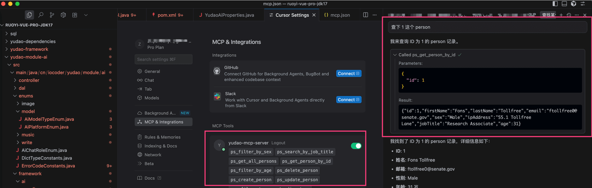

# MCP Server 服务端

Source: https://doc.iocoder.cn/ai/mcp-server/

前置阅读：

- [《一文看懂：MCP(大模型上下文协议)》](https://zhuanlan.zhihu.com/p/27327515233)
- 「可选」[《项目接入 MCP Server 代码》](https://gitee.com/zhijiantianya/ruoyi-vue-pro/commit/5b31f27)

## 1. 如何配置？

① 在项目的 `application.yaml` 中，配置 `spring.ai.mcp.server` 配置项，开启 MCP Server ，如下所示：

```
spring:
  ai:
    mcp:
      server:
        enabled: true
        name: yudao-mcp-server
        version: 1.0.0
        instructions: 一个 MCP 示例服务
        sse-endpoint: /sse
```

友情提示：

具体每个配置项的作用，可见 [《Spring AI 官方文档 —— MCP Client Client Starter》](https://docs.spring.io/spring-ai/reference/api/mcp/mcp-client-boot-starter-docs.html)  文档。

② 使用 [“Functions as Tools”](https://docs.spring.io/spring-ai/reference/api/tools.html#_functions_as_tools)  的方式，编写 MCP Server 的工具。

例如说：`cn.iocoder.yudao.module.ai.tool.method` 包下的 Person、PersonService、PersonServiceImpl 类。

③ 在 AiAutoConfiguration 的 `#toolCallbacks(...)` 方法，注册 MCP Server 的工具。

例如说：PersonService Bean 。

---

接着启动后端项目，可以看到 `INFO o.s.a.m.s.autoconfigure.McpServerAutoConfiguration` 日志，表示 MCP Client 启动成功。

## 2. 如何测试？

① 找一个支持 MCP Server 的工具，例如说 Cursor 或者 Claude 等。这里使用 Cursor，例如说：

```
{
  "mcpServers": {
    "yudao-mcp-server": {
      "url": "http://127.0.0.1:8089/sse"
    }
  }
}
```

② 在 Cursor 输入 “查下 1 这个 person” 消息，触发 MCP Server 的调用。如下图所示：


