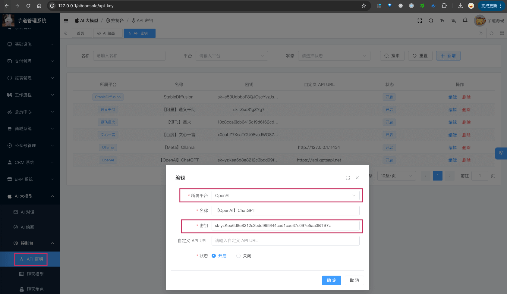
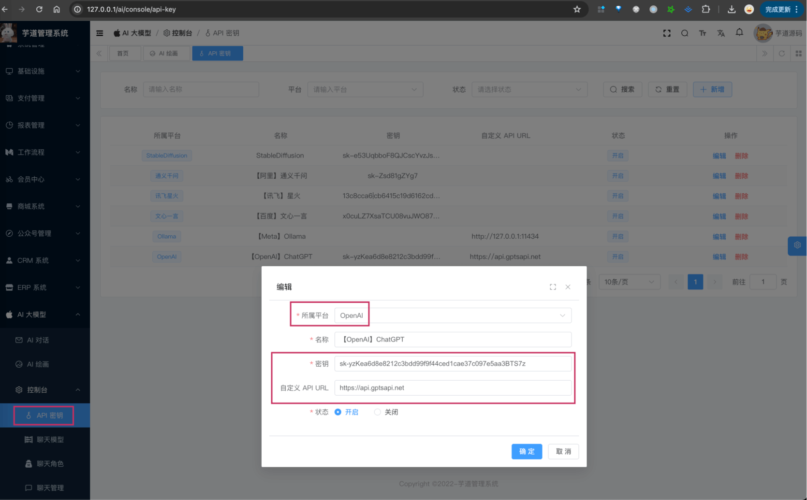

# 【模型接入】OpenAI

Source: https://doc.iocoder.cn/ai/openai/

项目基于 Spring AI 提供的 [`spring-ai-openai`](https://github.com/spring-projects/spring-ai/tree/main/models/spring-ai-openai) ，实现 OpenAI 的接入：

| 功能 | 模型 | Spring AI 客户端 |
| --- | --- | --- |
| AI 对话 | gpt3.5、gpt4.0 等 | [OpenAIChatModel](https://docs.spring.io/spring-ai/reference/api/chat/openai-chat.html) |
| AI 绘画 | [DALL](https://en.wikipedia.org/wiki/DALL-E) | [OpenAIImageModel](https://docs.spring.io/spring-ai/reference/api/image/openai-image.html) |

友情提示：

如果你使用的是微软 Azure 提供的 OpenAI 服务，可阅读 [《【模型接入】微软 OpenAI》](../azure-openai/index.md) 文档。

## 1. 申请密钥

由于 OpenAI 是非开源的模型，所以无法私有化部署，需要去官网申请 API Key，然后通过 Spring AI 提供的客户端接入。

不过，目前市面上有很多 OpenAI 的中转 API 服务，通过购买这些服务，也能实现接入。

疑问：什么是“中转 API 服务”？

简单来说，就是有人通过一定的渠道，获取了大量的 OpenAI、MidJourney 等 API 账号，然后部署一个 API 池子（服务）。

中转人卖给你一个 API KEY 令牌，你就可以把 AI 请求发送到他的池子：池子采取一定的算法选取一个 API 账号帮你把请求发送到大模型后端，然后再把大模型返回的结果转发给你。

下面，我们来看看这两种方式怎么申请？

### 1.1 方式一：官方 API 申请

可以参考 [《OpenAI API keys 的申请和测试小结 》](https://www.cnblogs.com/klchang/p/17352911.html)  进行申请。

会略微麻烦一些，我自己是直接采用了“方式二：中转 API 申请”。

---

申请完成后，可以在我们系统的 [AI 大模型 -> 控制台 -> API 密钥] 菜单，进行密钥的配置。只需要填写“密钥”，不需要填写“自定义 API URL”（因为 Spring AI 默认官方地址）。如下图所示：



友情提示：官方的 API 禁止国内直接访问，需要有 VPN 代理~

### 1.2 方式二：中转 API 申请

提供中转 API 服务的有很多，也可以 Google 直接搜索“openai API 中转”，例如说：

- [https://aihubmix.com](https://aihubmix.com?aff=E13A)  【目前使用的比较多，胖友们反馈也非常不错！】
- [毫秒 API](https://api.holdai.top/register?aff=EcRu)  【临时体验，可少量充值体验】

友情提示：少量购买，可以使用体验即可！

---

购买完成后，可以在我们系统的 [AI 大模型 -> 控制台 -> API 密钥] 菜单，进行密钥的配置。需要填写“密钥” + “自定义 API URL”（因为让 Spring AI 使用该地址）。如下图所示：



## 2. 模型配置

友情提示：

目前 `ai_model` 表中，已经预置了一些模型，可以直接使用！！！

### 2.1 AI 对话

使用 [《AI 对话》](../chat/index.md) 时，需要在 [AI 大模型 -> 控制台 -> 模型配置] 菜单，配置对应的聊天模型。

模型有：`gpt-3.5-turbo`、`gpt-4-turbo` 等等。

注意，每个模型标识的 `max_tokens`（回复数 Token 数）是不同的。例如说：`gpt-3.5-turbo` 是 4096，`gpt-4-turbo` 是 8192。不确定的话，就填写 4096 先~跑通之后，再网上查查。

### 2.2 AI 绘图

使用 [《AI 绘图》](../image/index.md) 时，需要在 [AI 大模型 -> 控制台 -> 模型配置] 菜单，配置对应的图像模型。

模型有：`dall-e-3`、`dall-e-2` 等等。

## 3. 如何使用？

① 如果你的项目里需要直接通过 `@Resource` 注入 OpenAiChatModel、OpenAiImageModel 等对象，需要把 `application.yaml` 配置文件里的 `spring.ai.openai` 配置项，替换成你的！

```
spring:
  ai:
    openai:
      api-key: # 你的密钥
      base-url: # 如果是中转 API，这里填写中转 API 的地址；如果是官方的，这里不需要填写
```

② 如果你希望使用 [AI 大模型 -> 控制台 -> API 密钥] 菜单的密钥配置，则可以通过 AiModelService 的 `#getChatModel(...)` 或 `#getImageModel(...)` 方法，获取对应的模型对象。

---

① 和 ② 这两者的后续使用，就是标准的 Spring AI 客户端的使用，调用对应的方法即可。

另外，OpenAIChatModelTests 和 OpenAiImageModelTests 里有对应的测试用例，可以参考。
