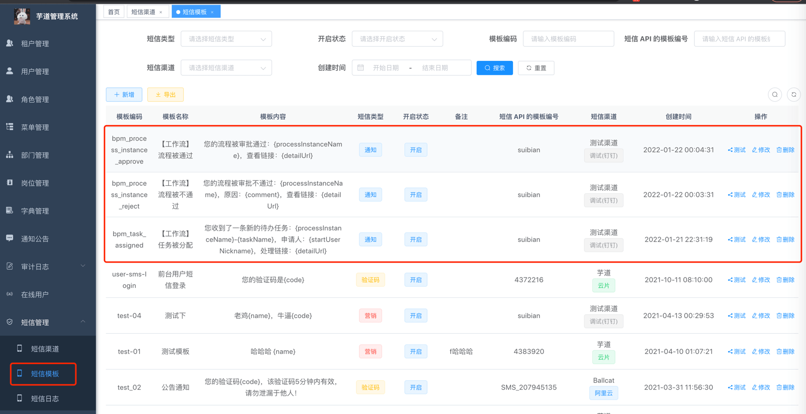
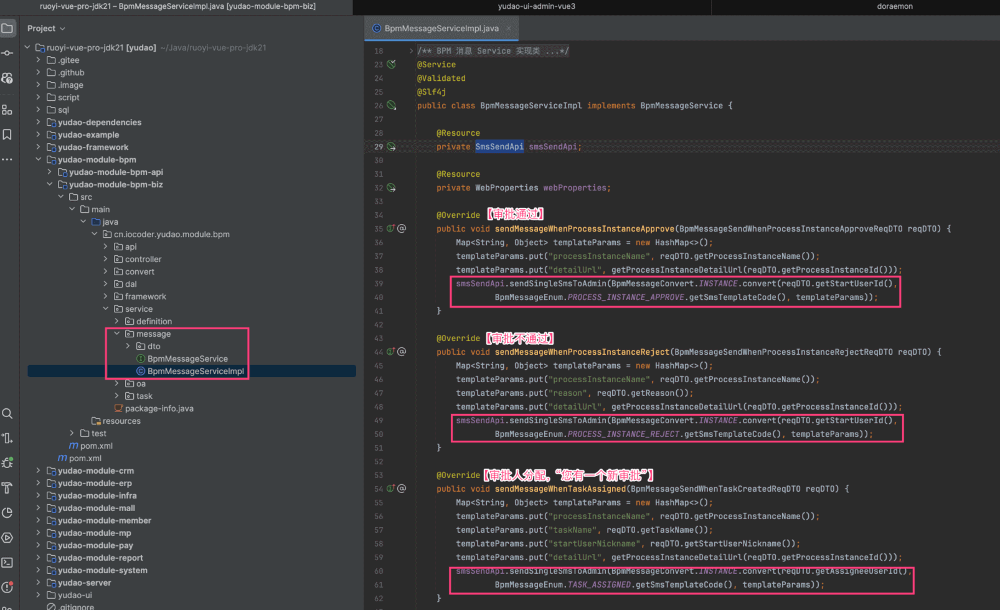

# 流程审批通知

Source: https://doc.iocoder.cn/bpm/message/

相关视频：

- [22、如何实现工作流的短信通知？](https://t.zsxq.com/04eyRRJ2f)

流程（审批）在发生变化时，会发送通知给相关的人。目前有三个场景会有通知，通过短信的方式。

它是通过 [BpmMessageService](https://github.com/YunaiV/ruoyi-vue-pro/blob/master/yudao-module-bpm/src/main/java/cn/iocoder/yudao/module/bpm/framework/flowable/core/candidate/expression/BpmTaskAssignLeaderExpression.java)  调用 SmsSendApi 短信 API 所实现，如下图所示：

图片纠错：最新版本不区分 yudao-module-bpm-api 和 yudao-module-bpm-biz 子模块，代码直接合并到 yudao-module-bpm 模块的 src 目录下，更适合单体项目

① 如果想要接入其它通知方式，在 BpmMessageService 调用其它通知的 API 即可，例如说：

- [《邮件配置》](../../mail/index.md)
- [《站内信配置》](../../notify/index.md)

② 如果想要更多场景的通知，可以考虑基于 [《执行监听器、任务监听器》](../listener/index.md) 实现，在监听器中调用通知 API。
