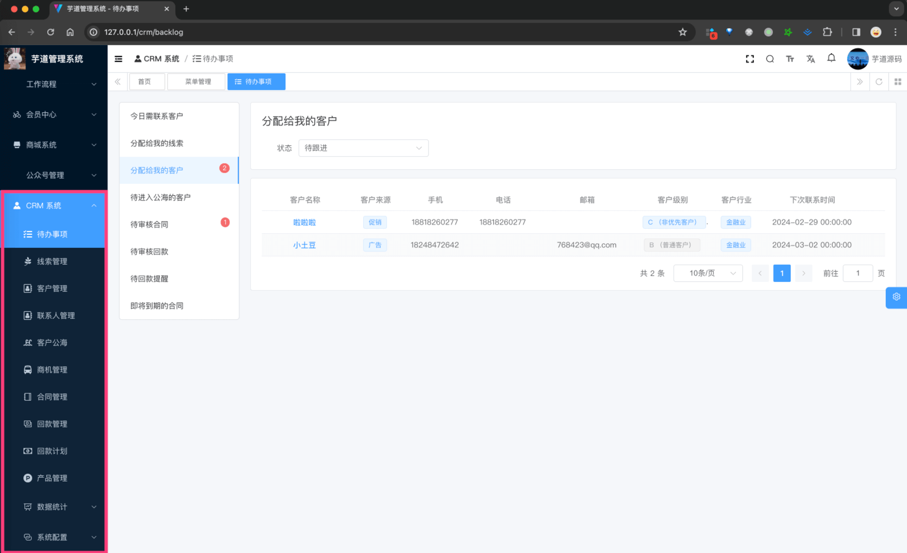
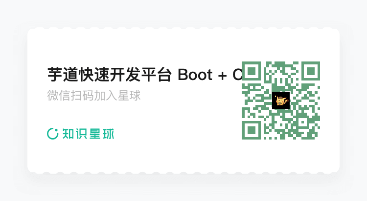
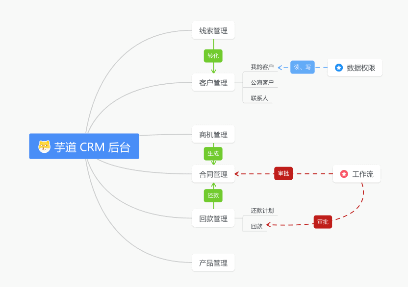
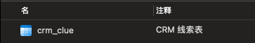
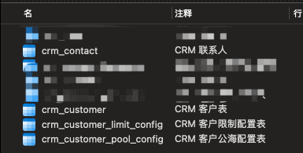
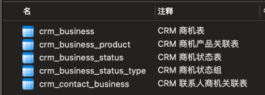
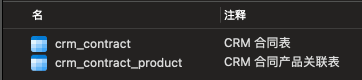
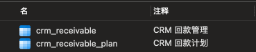
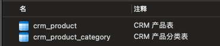

# CRM 演示

Source: https://doc.iocoder.cn/crm-preview/

## 1. 演示地址

### 1.1 CRM 管理后台

- 演示地址：<http://dashboard-vue3.yudao.iocoder.cn/>
- 菜单：“CRM 系统”下的「待办事项」「线索管理」「客户管理」「联系人管理」「客户公海」「商机管理」「合同管理」「回款计划」「还款管理」「产品管理」「数据统计」
- 仓库：<https://github.com/yudaocode/yudao-ui-admin-vue3> 的 `crm` 目录，基于 Vue3 + Element Plus 实现

### 1.2 CRM 后端

支持 Spring Boot 单体、Spring Cloud 微服务架构

- 单体仓库： <https://github.com/YunaiV/ruoyi-vue-pro> 的 `yudao-module-crm` 模块
- 微服务仓库： <https://github.com/YunaiV/yudao-cloud> 的 `yudao-module-crm` 服务

## 2. CRM 启动

参见 [《CRM 手册 —— 功能开启》](../crm/build/index.md) 文档，一般 3 分钟就可以启动完成。

## 3. CRM 交流

专属交流社区，欢迎扫码加入。

## 4. 功能描述

主要分为 6 个核心模块：线索、客户、商机、合同、回款、产品。

## 5. 表结构

CRM 一共近 **20+** 张表，具备一定的业务复杂度，对提升技术能力会有不错的帮助，平时做项目也可以参考参考。

### 5.1 线索管理

以 `crm_clue` 作为核心表，表结构如下：

- [《【线索】线索管理》](../crm/clue/index.md)

### 5.2 客户管理

以 `crm_customer` 作为核心表，表结构如下：

- [《【线索】线索管理》](../crm/customer/index.md)

## 5.3 商机管理

以 `crm_business` 作为核心表，表结构如下：

- [《【商机】商机管理、商机状态》](../crm/business/index.md)

## 5.4 合同管理

以 `crm_contract` 作为核心表，表结构如下：

- [《【合同】合同管理、合同提醒》](../crm/contract/index.md)

## 5.5 回款管理

以 `crm_receivable` 作为核心表，表结构如下：

- [《【回款】回款管理、回款计划》](../crm/receivable/index.md)

## 5.6 产品管理

以 `crm_product` 作为核心表，表结构如下：

- [《【产品】产品管理、产品分类》](../crm/product/index.md)

## 5.7 通用模块

- [《【通用】数据权限》](../crm/permission/index.md)
- [《【通用】跟进记录、待办事项》](../crm/follow-up/index.md)

## 5.8 数据统计

TODO 数据统计
