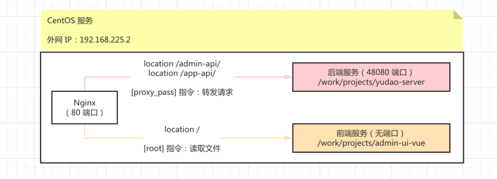
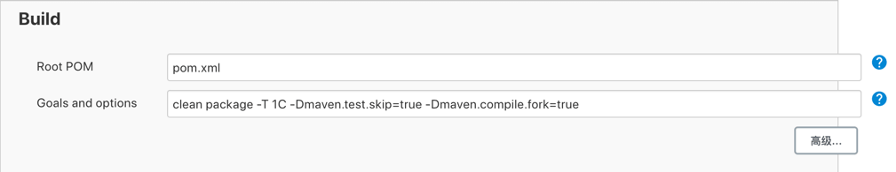
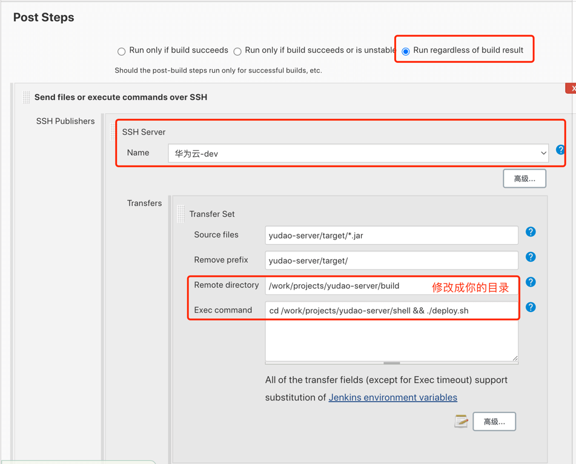
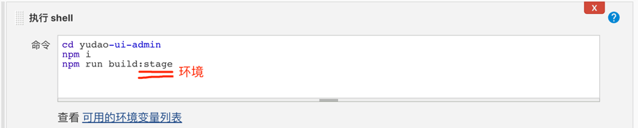
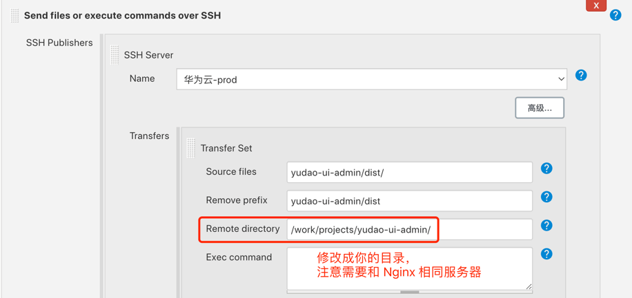

# Jenkins 部署

Source: https://doc.iocoder.cn/deployment-jenkins/

本小节，讲解如何将前端 + 后端项目，**使用 Jenkins 工具**，部署到 dev 开发环境下的一台 Linux 服务器上。如下图所示：

友情提示：

本文是 [《开发指南 —— Linux 部署》](../deployment-linux/index.md) 的加强版，差别在于使用 Jenkins 部署。

## 1. 安装 Jenkins

阅读 [《芋道 Jenkins 极简入门 》](https://www.iocoder.cn/Jenkins/install/?yudao)  文章，进行 Jenkins 的安装。

## 2. 部署后端

阅读 [《芋道 Spring Boot 持续交付 Jenkins 入门 》](https://www.iocoder.cn/Spring-Boot/Jenkins/?yudao)  文章，进行后端的部署。

可参考 Jenkins 配置如下：

## 3. 部署前端

可参考 Jenkins 配置如下：

