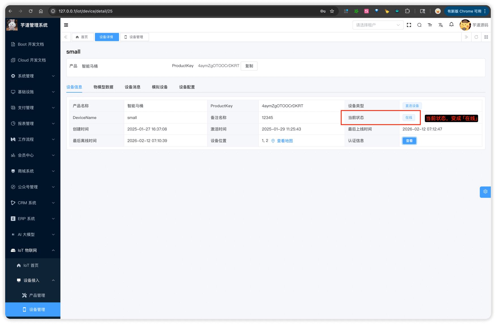
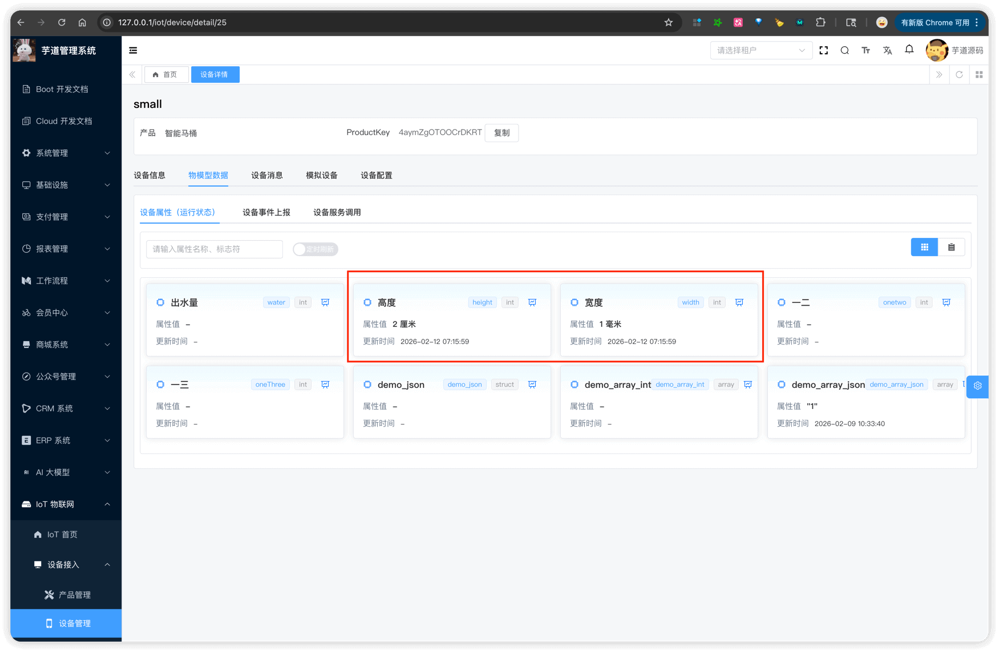
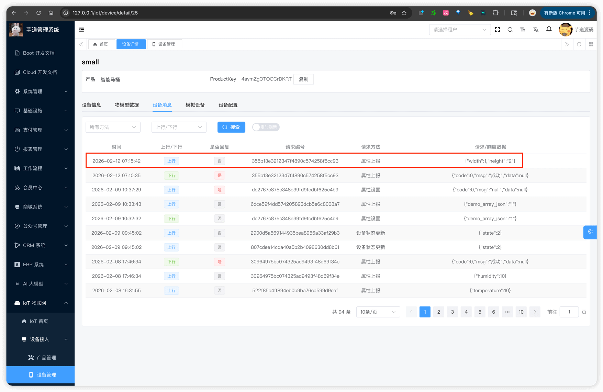
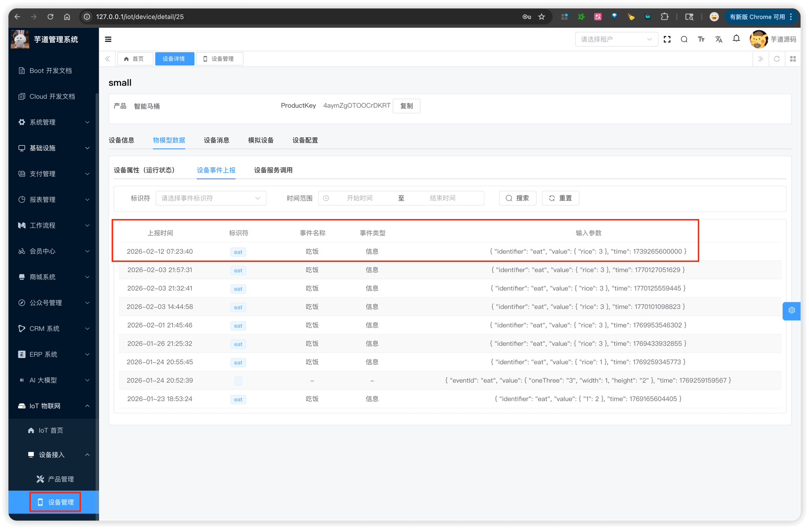
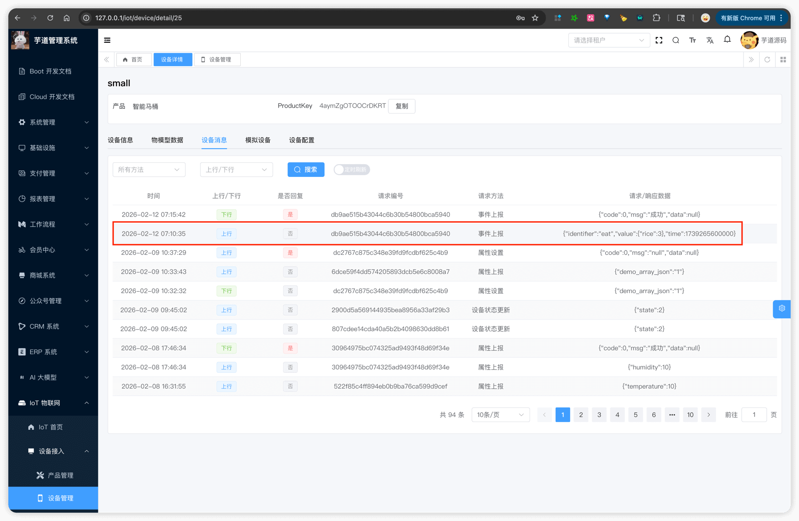

# 设备接入（HTTP 协议）

Source: https://doc.iocoder.cn/iot/protocol-http/

推荐阅读：

- [《设备接入（概述）》](../protocol-overview/index.md) — 建议先阅读，了解整体架构和消息格式
- [《阿里云物联网平台 —— 使用 HTTPS 协议自主接入》](https://help.aliyun.com/zh/iot/user-guide/establish-connections-over-https)

HTTP 协议接入，由 `yudao-module-iot-gateway` 模块的 `protocol.http` 包实现，基于 Vert.x HTTP Server，默认端口 8092。

HTTP 协议仅支持**上行**（设备 → 平台），无法下行推送。如需双向通信，请使用 [MQTT 协议](../protocol-mqtt/index.md)。

## 1. 整体架构

### 1.1 认证方式

HTTP 使用 **JWT Token** 进行无状态认证：

1. 设备发送 `POST /auth`，携带 `clientId`、`username`、`password`
2. 网关验证成功后返回 JWT Token
3. 后续请求通过 `Authorization` Header 携带该 Token

认证由 IotHttpAuthHandler 处理。

### 1.2 接口列表

| 路径 | 说明 | Handler 类 | 认证 |
| --- | --- | --- | --- |
| `POST /auth` | 设备认证，获取 Token | IotHttpAuthHandler | 无 |
| `POST /auth/register/device` | [设备动态注册（一型一密）](../device-register/index.md) | IotHttpRegisterHandler | 无 |
| `POST /auth/register/sub-device/:productKey/:deviceName` | [子设备动态注册](../device-register/index.md) | IotHttpRegisterSubHandler | Token |
| `POST /topic/sys/:productKey/:deviceName/*` | 上行消息（属性 / 事件等） | IotHttpUpstreamHandler | Token |

上行消息接口的 URL 路径中，`*` 通配符部分会被转换为 IotDeviceMessageMethodEnum 消息方法（斜杠转点号），例如：

- `/topic/sys/{productKey}/{deviceName}/thing/property/post` → method: `thing.property.post`
- `/topic/sys/{productKey}/{deviceName}/thing/event/post` → method: `thing.event.post`

## 2. 配置说明

在**网关**的 `application.yaml` 的 `yudao.iot.gateway.protocols` 中配置 HTTP 协议实例：

```
yudao:
  iot:
    gateway:
      protocols:
        - id: http-json
          enabled: true          # 是否启用
          protocol: http         # 协议类型
          port: 8092             # 监听端口
```

对应 IotGatewayProperties.ProtocolProperties 通用配置类、和 IotHttpConfig 专属配置类。

> 注意：测试前需确保 `enabled` 设置为 `true`，否则协议不会启动。

## 3. 快速测试【推荐】

可以通过以下集成测试类快速体验，具体步骤见各类的注释：

| 设备类型 | 测试类 |
| --- | --- |
| 直连设备 | IotDirectDeviceHttpProtocolIntegrationTest |
| 网关设备 | IotGatewayDeviceHttpProtocolIntegrationTest |
| 网关子设备 | IotGatewaySubDeviceHttpProtocolIntegrationTest |

## 4. 手工测试（直连设备）

以内置的 id 为 25 的 [演示设备](http://127.0.0.1/iot/device/detail/25)  为例进行测试。

### 4.1 设备认证

① 使用设备三元组，发起 HTTP 请求：

```
curl -X POST http://127.0.0.1:8092/auth \
  -H "Content-Type: application/json" \
  -d '{
    "clientId": "4aymZgOTOOCrDKRT.small",
    "username": "small&4aymZgOTOOCrDKRT",
    "password": "509e2b08f7598eb139d276388c600435913ba4c94cd0d50aebc5c0d1855bcb75"
  }'
```

认证成功后返回 JWT Token：

```
{
  "code": 0,
  "data": {
    "token": "eyJ0eXAiOiJKV1QiLCJhbGciOiJIUz..."
  },
  "msg": ""
}
```

后续请求需在 `Authorization` Header 中携带该 Token。

② 可以在管理后台看到设备状态变为「在线」：



### 4.2 属性上报

> 请将 URL 中的 `{productKey}`、`{deviceName}` 替换为实际值，`Authorization` 替换为 4.1 返回的 Token。

① 发起 HTTP 请求：

```
curl -X POST http://127.0.0.1:8092/topic/sys/{productKey}/{deviceName}/thing/property/post \
  -H "Content-Type: application/json" \
  -H "Authorization: 你的Token" \
  -d '{
    "method": "thing.property.post",
    "params": {
        "width": 1,
        "height": "2"
    }
  }'
```

`params` 为属性键值对，Key 为物模型中定义的属性标识符（identifier），Value 为属性值。

② 可以在管理后台查看上报的属性数据：





### 4.3 事件上报

> 同上，替换 URL 中的 `{productKey}`、`{deviceName}` 和 `Authorization`。

① 发起 HTTP 请求：

```
curl -X POST http://127.0.0.1:8092/topic/sys/{productKey}/{deviceName}/thing/event/post \
  -H "Content-Type: application/json" \
  -H "Authorization: 你的Token" \
  -d '{
    "method": "thing.event.post",
    "params": {
        "identifier": "eat",
        "value": {
            "rice": 3
        },
        "time": 1739265600000
    }
  }'
```

`params` 中 `identifier` 为事件标识符，`value` 为事件输出参数，`time` 为事件发生时间（毫秒时间戳，可选）。

② 可以在管理后台查看上报的事件数据：




