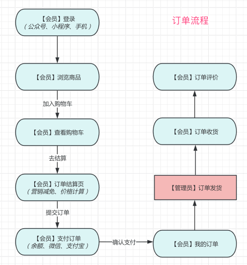
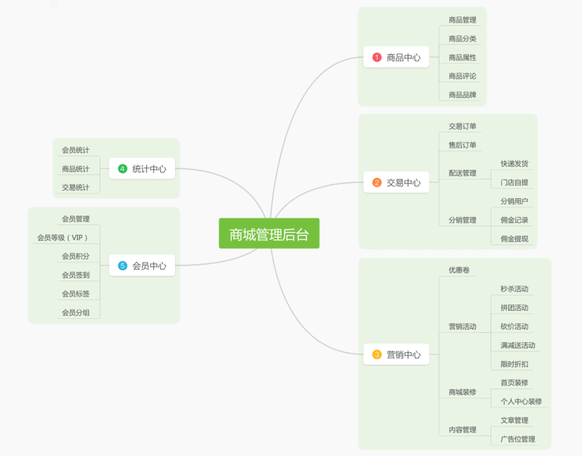
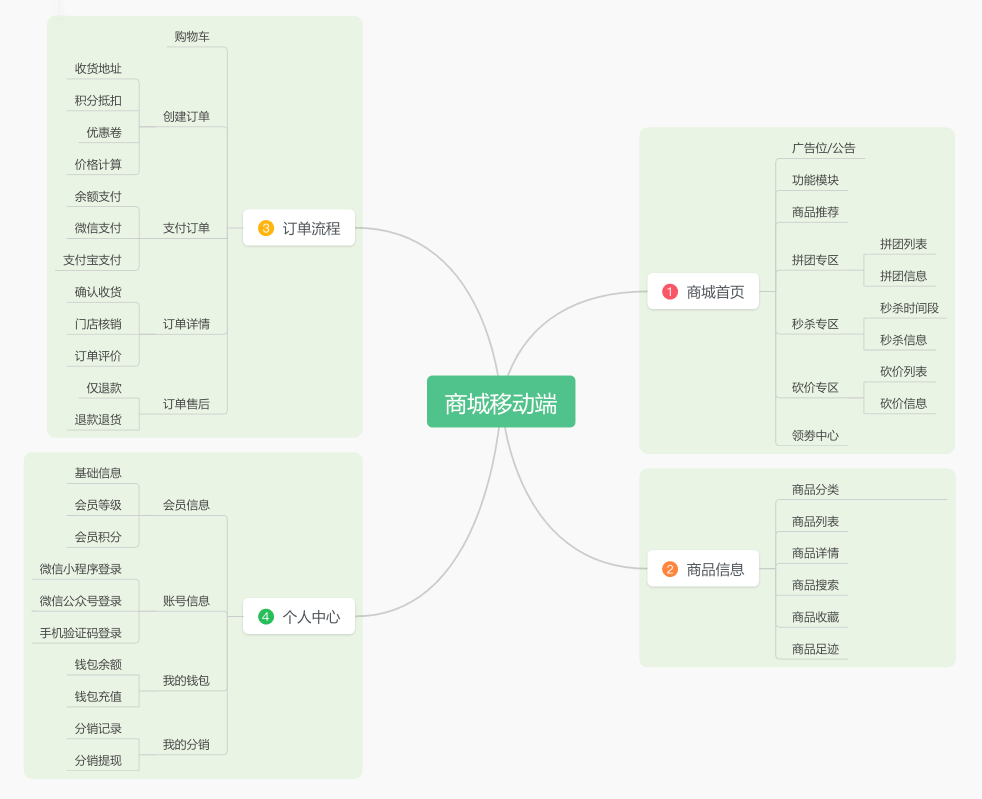
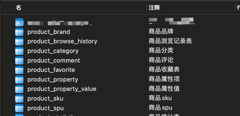
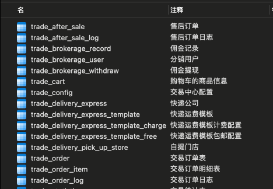
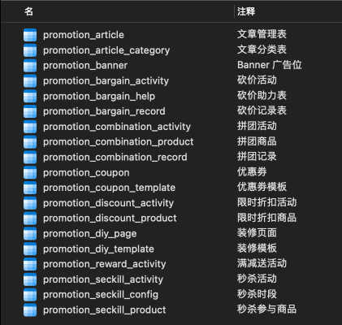
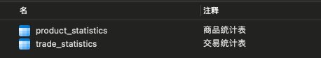
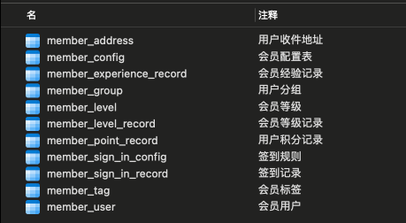
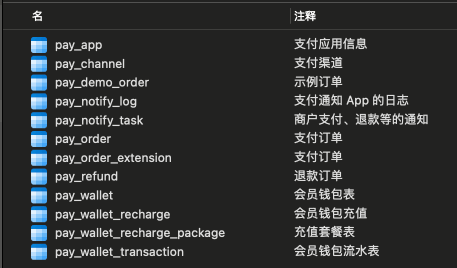

# 商城演示

Source: https://doc.iocoder.cn/mall-preview/

## 1. 演示地址

### 1.1 商城移动端

- 演示地址：<http://mall.yudao.iocoder.cn/>
- 账号：可使用账号 15601691300，验证码 9999 进行登录
- 仓库：<https://github.com/yudaocode/yudao-mall-uniapp> 仓库，目前是基于 Vue3 + uni-app 实现

### 1.2 商城管理后台

- 演示地址：<http://dashboard-vue3.yudao.iocoder.cn/>
- 菜单：「会员中心」「商品中心」「订单中心」「营销中心」「统计中心」「支付中心」
- 仓库：<https://github.com/yudaocode/yudao-ui-admin-vue3>，基于 Vue3 + Element Plus 实现

### 1.3 商城后端

支持 Spring Boot 单体、Spring Cloud 微服务架构

- 单体仓库： <https://github.com/YunaiV/ruoyi-vue-pro>
- 微服务仓库： <https://github.com/YunaiV/yudao-cloud>

## 2. 商城启动

参见 [《商城手册 —— 功能开启》](../mall/build/index.md) 文档，一般 3 分钟就可以启动完成。

## 3. 商城交流

专属交流社区，欢迎扫码加入。

## 4. 功能概述

主要分为 4 个核心模块（商品、订单、营销、统计）、2 个基础模块（会员、支付）。

目前已经比较完善，可以支持一整套电商流程，不少公司已经在生产中使用。

### 4.1 商城管理后台

### 4.2 商城移动端

## 5. 表结构

商城一共有 **70+** 张表，具备一定的业务复杂度，对提升技术能力会有不错的帮助，平时做项目也可以参考参考。

### 5.1 商品模块（中心）

以 `product_` 作为前缀的表，表结构如下：

可学习文档：

- [《【商品】商品分类》](../mall/product-category/index.md)
- [《【商品】商品属性》](../mall/product-property/index.md)
- [《【商品】商品 SPU 与 SKU》](../mall/product-spu-sku/index.md)
- [《【商品】商品评价》](../mall/product-comment/index.md)

### 5.2 交易模块（中心）

以 `trade_` 作为前缀的表，表结构如下：

可学习文档：

- [《【交易】购物车》](../mall/trade-cart/index.md)
- [《【交易】商品订单》](../mall/trade-order/index.md)
- [《【交易】售后退款》](../mall/trade-aftersale/index.md)
- [《【交易】快递发货》](../mall/trade-delivery-express/index.md)
- [《【交易】门店自提》](../mall/trade-delivery-pickup/index.md)
- [《【交易】分销返佣》](../mall/trade-brokerage/index.md)

### 5.3 营销模块（中心）

以 `promotion_` 作为前缀的表，表结构如下：

可学习文档：

- [《店铺装修》](../mall/diy/index.md)
- [《【营销】优惠劵》](../mall/promotion-coupon/index.md)
- [《【营销】积分商城》](../mall/point-activity/index.md)
- [《【营销】拼团活动》](../mall/promotion-combination/index.md)
- [《【营销】秒杀活动》](../mall/seckill-combination/index.md)
- [《【营销】砍价活动》](../mall/seckill-bargain/index.md)
- [《【营销】满减送》](../mall/promotion-record/index.md)
- [《【营销】限时折扣》](../mall/promotion-discount/index.md)
- [《【营销】内容管理》](../mall/promotion-content/index.md)

### 5.4 统计模块（中心）

以 `_statistics` 作为后缀的表，表结构如下：

- [《【统计】会员、商品、交易统计》](../mall/statistics/index.md)

### 5.5 会员模块（中心）

以 `member_` 作为前缀的表，表结构如下：

### 5.6 支付模块（中心）

以 `pay_` 作为前缀的表，表结构如下：

