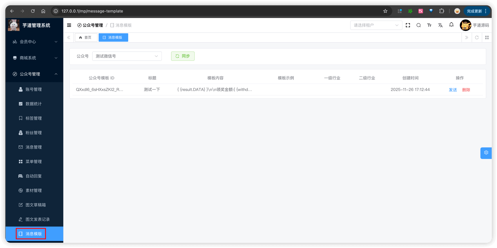
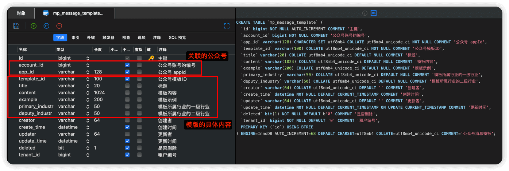
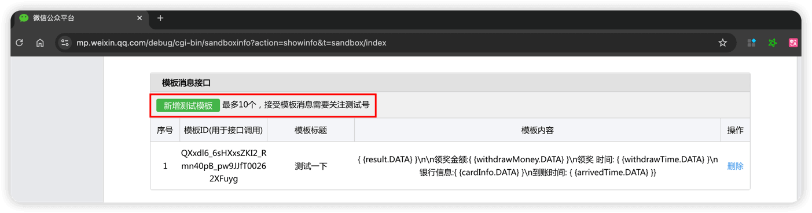
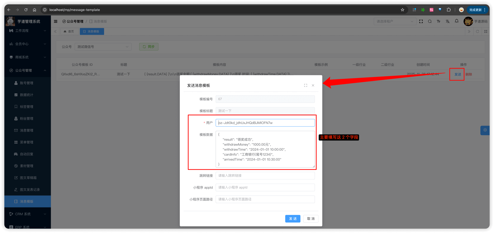

# 模版消息

Source: https://doc.iocoder.cn/mp/message-template/

本章节，讲解模版消息的相关内容，支持对模版进行同步、删除、发送等操作，对应 [《微信公众号官方文档 —— 模板消息》](https://developers.weixin.qq.com/doc/service/guide/product/template_message/Template_Message_Interface.html)  文档。

## 1. 表结构

公众号粉丝对应 `mp_message_template` 表，结构如下图所示：

## 2. 模版管理界面

- 前端：[/@views/mp/messageTemplate](https://github.com/yudaocode/yudao-ui-admin-vue3/blob/master/src/views/mp/messageTemplate/index.vue)
- 后端：[MpMessageTemplateController](https://github.com/YunaiV/ruoyi-vue-pro/blob/master/yudao-module-mp/src/main/java/cn/iocoder/yudao/module/mp/controller/admin/message/MpMessageTemplateController.java)

## 3. 同步模版

点击模版消息界面的【同步】按钮，可以从公众号同步所有的模版信息，存储到 `mp_message_template` 表中。

对应后端的 [MpMessageTemplateServiceImpl](https://github.com/YunaiV/ruoyi-vue-pro/blob/master/yudao-module-mp/src/main/java/cn/iocoder/yudao/module/mp/service/message/MpMessageTemplateServiceImpl.java#L94-L133)  的 `syncMessageTemplate` 方法。

## 4. 发送模版消息

① 在微信公众号平台中，点击【新增测试模版】按钮，新增一个测试模版消息，如下图所示：

② 点击模版消息界面的【发送】按钮，弹出发送模版消息对话框，如下图所示：

对应后端的 [MpMessageTemplateServiceImpl](https://github.com/YunaiV/ruoyi-vue-pro/blob/master/yudao-module-mp/src/main/java/cn/iocoder/yudao/module/mp/service/message/MpMessageTemplateServiceImpl.java#L135-L151)  的 `sendMessageTempalte` 方法。
