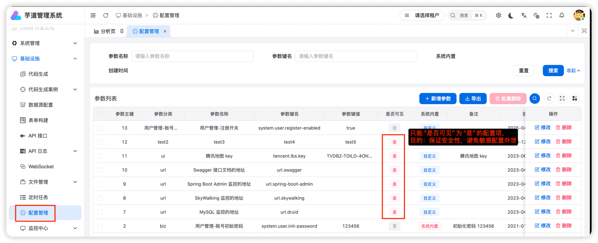
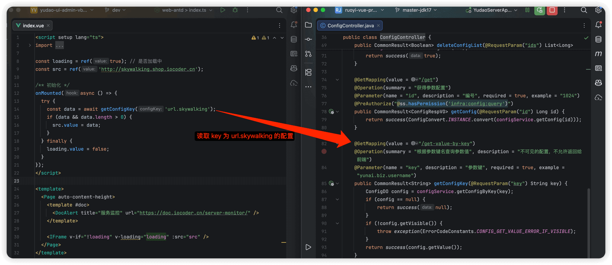

# 配置读取

Source: https://doc.iocoder.cn/vben5/config-center/

在 [基础设施 -> 配置管理] 菜单，可以动态修改配置，无需重启服务器即可生效。



提示

对应 [《后端手册 —— 配置中心》](../../config-center/index.md) 文档。

## 1. 读取配置

前端调用 [`#/api/infra/config/index.ts`](https://github.com/yudaocode/yudao-ui-admin-vben/blob/master/apps/web-antd/src/api/infra/config/index.ts#L36-L41)  的 `getConfigKey(configKey)` 方法，获取指定 key 对应的配置的值。代码如下：

```
/** 根据参数键名查询参数值 */
export function getConfigKey(configKey: string) {
  return requestClient.get<string>(
    `/infra/config/get-value-by-key?key=${configKey}`,
  );
}
```

## 2. 实战案例

在 [`apps/web-antd/src/views/infra/skywalking/index.vue`](https://github.com/yudaocode/yudao-ui-admin-vben/blob/master/apps/web-antd/src/views/infra/skywalking/index.vue)  页面中，获取 key 为 `"url.skywalking"` 的配置的值。代码如下：


