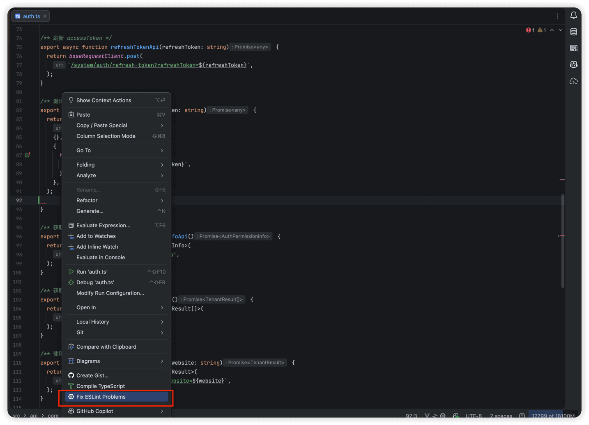
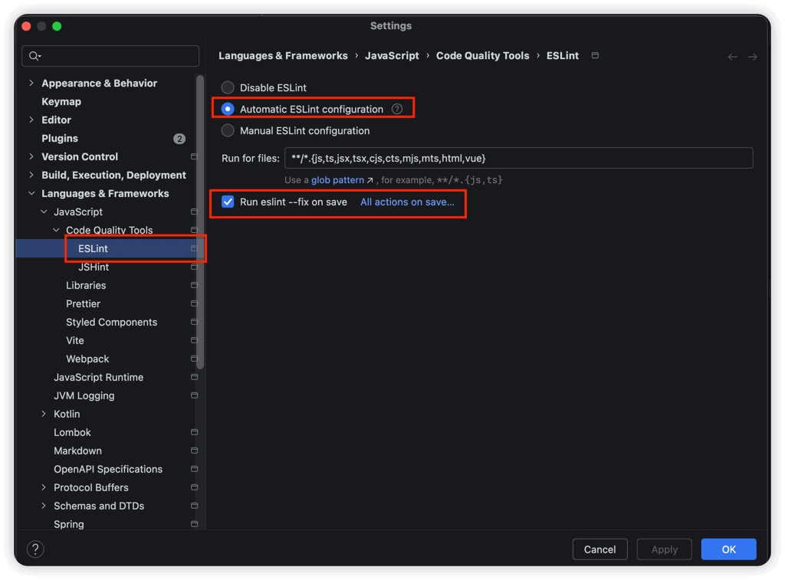
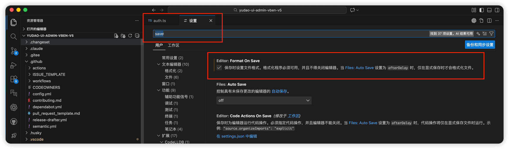

# 代码格式化

Source: https://doc.iocoder.cn/vben5/format/

友情提示

强烈建议先阅读 Vben Admin 官方文档，了解框架的基础概念和使用方式：

- [《规范》](https://doc.vben.pro/guide/project/standard.html)

项目的 lint 配置文件位于 [internal/lint-configs](https://github.com/yudaocode/yudao-ui-admin-vben/tree/master/internal/lint-configs)  目录下：

| 目录 | 说明 |
| --- | --- |
| `eslint-config` | ESLint 配置 |
| `prettier-config` | Prettier 配置 |
| `stylelint-config` | Stylelint 配置 |
| `commitlint-config` | Commitlint 配置 |

项目内集成了以下几种代码校验工具：

- [ESLint](https://eslint.org/) ：用于 JavaScript/TypeScript 代码检查
- [Stylelint](https://stylelint.io/) ：用于 CSS/SCSS 样式检查
- [Prettier](https://prettier.io/) ：用于代码格式化
- [Commitlint](https://commitlint.js.org/) ：用于 Git 提交信息规范检查

我们可以使用 IDE 自带的 Linter 功能，实现代码的格式化（自动检查和修复）。

友情提示：

如果你想使用 Prettier 插件，可参考 [《代码格式化（Prettier）》](https://vue3/format) 文档。

## 1. JetBrains 端

参考 [《JetBrains 官方文档》](https://www.jetbrains.com/help/idea/linters.html)  操作即可。

---

① 【手动修复】右键文件，选择 `Fix ESLint Problems` 即可。如下图所示：

② 【自动修复】可在 JetBrains 设置界面的 ESLint 选项中，勾选上 `Run eslint --fix on save` 选项，如下图所示：

之后，保存页面，页面代码自动格式化。

## 2. VS Code 端

参考 [《VS Code 官方文档》](https://code.visualstudio.com/docs/languages/javascript#_linters)  操作即可。

---

【自动修复】打开 VS Code 配置，搜索 save 后，勾选上 `Format On Save` 选项。如下图所示：

之后，保存页面，页面代码自动格式化。
