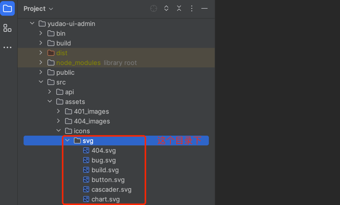
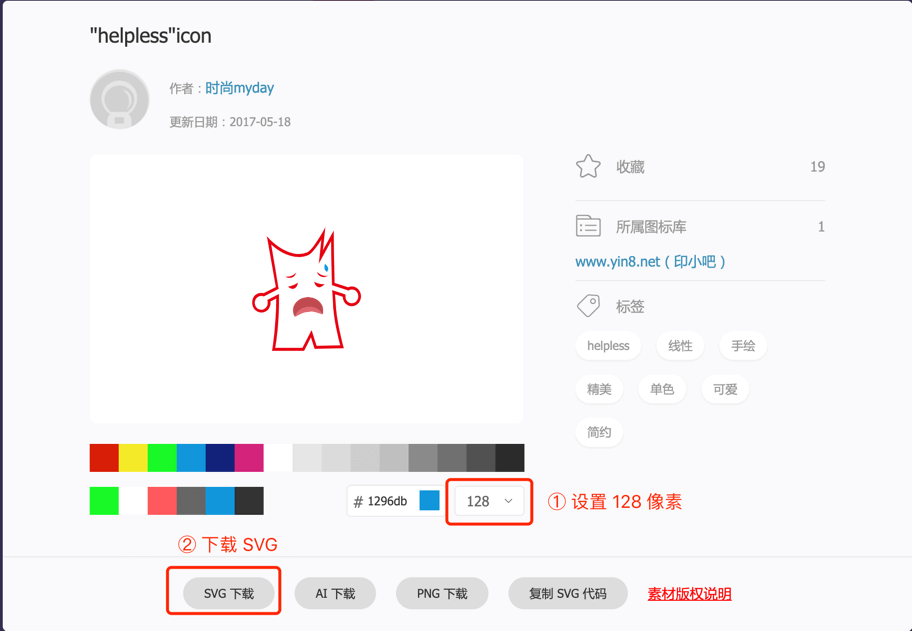

# Icon 图标

Source: https://doc.iocoder.cn/vue2/icon/

Element UI 内置多种 Icon 图标，可参考 [Element Icon 图标](https://element.eleme.cn/#/zh-CN/component/icon)  的文档。

在项目的 [`/src/assets/icons/svg`](https://github.com/yudaocode/yudao-ui-admin-vue2/tree/master/src/assets/icons/svg)  目录下，自定义了 Icon 图标，默认注册到全局中，可以在项目中任意地方使用。如下图所示：



## 1. 使用方式

```
<!-- 示例一：
    icon-class 为 icon 的名字
    class-name 为 icon 的自定义 class
-->
<svg-icon icon-class="password" class-name='custom-class' />

<!-- 示例二：
    icon 为 Element UI 的图标
-->
<el-button icon="el-icon-plus">新增</el-button>

<!-- 示例三：结合上述两示例 -->
<el-button>
    <svg-icon icon-class="password" class-name='custom-class' /> 新增
</el-button>
```

## 2. 自定义图标

① 访问 <https://www.iconfont.cn/> 地址，搜索你想要的图标，下载 SVG 格式。如下图所示：

友情提示：其它 SVG 图标网站也可以。



② 将 SVG 图标添加到 [`@/icons/svg`](https://github.com/yudaocode/yudao-ui-admin-vue2/tree/master/src/assets/icons/svg)  目录下，然后进行使用。

```
<svg-icon icon-class="helpless" />
```

## 3. 改变颜色

`<svg-icon />` 默认会读取其父级的 color `fill: currentColor;` 。

你可以改变父级的 `color` ，或者直接改变 `fill` 的颜色即可。

疑问：

如果你遇到图标颜色不对，可以参照本 [issue](https://github.com/PanJiaChen/vue-element-admin/issues/330)  进行修改

## 4. 离线 Icon 改造

参考 <https://t.zsxq.com/gOKlQ> 文档。
