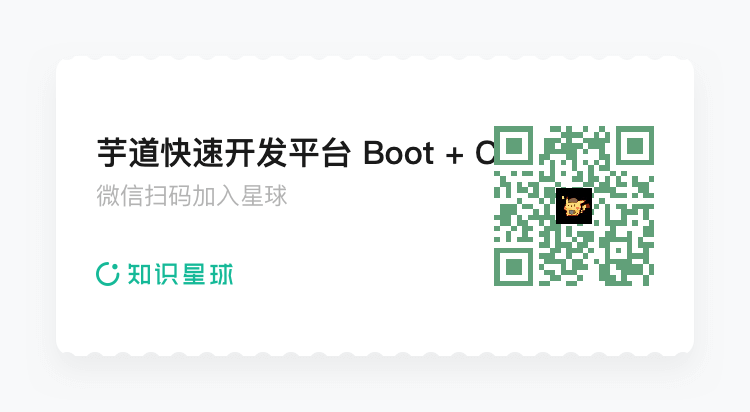

# 项目外包

Source: https://doc.iocoder.cn/waibao/

我们也是接外包滴，如果你有项目想要外包，可以微信联系。

团队包含专业的项目经理、架构师、前端工程师、后端工程师、测试工程师、运维工程师，可以提供全流程的外包服务。

项目可以是商城、SCRM 系统、OA 系统、物流系统、ERP 系统、CMS 系统、HIS 系统、支付系统、IM 聊天、微信公众号、微信小程序等等。

友情提示：

团队是软件公司，有稳定的交付团队！微信沟通时，希望可以提供以下信息，方便更好的支持：

- 项目类型：个人项目、公司项目、转包项目？
- 项目背景：为什么需要开发这个系统，希望解决哪些具体问题？
- 目标用户：用户希望通过这个系统解决什么问题？
- 核心功能：希望系统具备哪些核心功能？
- 预算范围：对系统开发的预算投入大概是多少？
- 时间要求：希望在什么时间上线？

---

微信不是客服噢！！！如果需要项目解答，建议加入扫码加入知识星球，更好的获得开发团队的答疑，如下图所示：

加入后，还有商城、微服务、工作流、支付、ERP、CRM、公众号等 [VIP 群](../qun/index.md) 。
